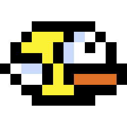

  

  <ul style="list-style: none;">
    

      <h1 align="center">
        Flappy Bird
      </h1>
    

  </ul>

<h3 align="center">
  An ECS Flappy Bird clone
</h3>

  &nbsp;
  &nbsp;
  &nbsp;
  &nbsp;
  

## Play

You can play the game [here](https://CaymanFreeman.github.io/FlappyBird). It may take a few seconds to download the
binary and the page will appear blank while this is happening.

## Overview

This project is a clone of the original game and is based the core movement mechanics from a video
by [Biped Potato](https://www.youtube.com/watch?v=_C28kqin94c). It uses the Bevy ECS (Entity-Component-System) game
engine. Thanks to Bevy and Rust's cross-platform compatibility, the game can be compiled
for almost any platform, including WebAssembly (WASM), allowing it to be played directly in your browser. A WASM version
of the game is hosted on this repository's [gh-pages](https://github.com/CaymanFreeman/FlappyBird/tree/gh-pages) branch.

## Attributions

- Sprites from [Biped Potato](https://github.com/Biped-Potato/flappy_bird/tree/master/assets)
- Sound effects from [samuelcust](https://github.com/samuelcust/flappy-bird-assets/tree/master/audio)
- Music by [ben_burnes](https://tallbeard.itch.io/music-loop-bundle) (Sketchbook 2024-10-30)
- Title and score font, [Light Pixel-7](https://www.1001fonts.com/light-pixel-7-font.html), and button
  font, [Mini Pixel-7](https://www.1001fonts.com/mini-pixel-7-font.html), by
  Sizenko Alexander at Style-7

## Local Build

W.I.P.
